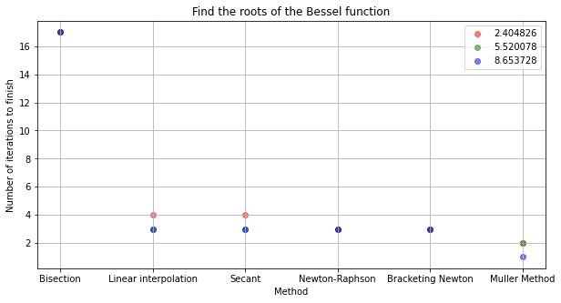
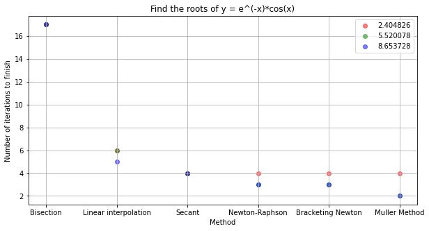

#  1. Find the roots of the Bessel function in the interval [1.0, 10.0] using the following methods

## The convergence speed of the methods
- Bisection is the slowest method to find the roots
- Linear interpolation is faster than Bisection, but slower than Secant
- Secant is faster than Linear interpolation since its parameter is more stable than Linear Interpolation
- Newton-Raphson is also fast enough to find the roots
- Newton with bracketing tend to be faster than Newton-Raphson because its initial guesses are important to the rapid convergence
- Muller Method is the fastest method as its parameter is stable like Secant and it quadratically converges

### a) Bisection (rtbis.c)
- Root in [2.350000, 2.440000]: 2.404826 (Required Steps = 17)
- Root in [5.500001, 5.590001]: 5.520078 (Required Steps = 17)
- Root in [8.650006, 8.740006]: 8.653728 (Required Steps = 17)

### b) Linear interpolation (rtflsp.c)
- Root in [2.350000, 2.440000]: 2.404826 (Required Steps = 4)
- Root in [5.500001, 5.590001]: 5.520078 (Required Steps = 3)
- Root in [8.650006, 8.740006]: 8.653728 (Required Steps = 3)

### c) Secant (rtsec.c)
- Root in [2.350000, 2.440000]: 2.404825 (Required Steps = 4)
- Root in [5.500001, 5.590001]: 5.520078 (Required Steps = 3)
- Root in [8.650006, 8.740006]: 8.653728 (Required Steps = 3)

### d) Newton-Raphson (rtnewt.c)
- Root in [2.350000, 2.440000]: 2.404825 (Required Steps = 3)
- Root in [5.500001, 5.590001]: 5.520078 (Required Steps = 3)
- Root in [8.650006, 8.740006]: 8.653728 (Required Steps = 3)

### e) Newton with bracketing (rtsafe.c)
- Root in [2.350000, 2.440000]: 2.404825 (Required Steps = 3)
- Root in [5.500001, 5.590001]: 5.520078 (Required Steps = 3)
- Root in [8.650006, 8.740006]: 8.653728 (Required Steps = 3)

### f) Muller Method
- Root in [2.350000, 2.440000]: 2.404825 (Required Steps = 2)
- Root in [5.500001, 5.590001]: 5.520078 (Required Steps = 2)
- Root in [8.650006, 8.740006]: 8.653726 (Required Steps = 1)

# 2. Solve one interesting nonlinear equation you want to solve using the routine of rtsafe.c in NR in C
- Using bracketing method, find the possible roots of my nonlinear function (e^(-x)*cos(x)).

### a) Bisection (rtbis.c)
- Root in [-4.800000, -4.700000]: -4.712389 (Required Steps = 17)
- Root in [-1.600003, -1.500003]: -1.570797 (Required Steps = 17)
- Root in [1.499998 ,  1.599998]:  1.570797 (Required Steps = 17)

### b) Linear interpolation (rtflsp.c)
- Root in [-4.800000, -4.700000]: -4.712389 (Required Steps = 6)
- Root in [-1.600003, -1.500003]: -1.570796 (Required Steps = 6)
- Root in [1.499998 ,  1.599998]:  1.570796 (Required Steps = 5)

### c) Secant (rtsec.c)
- Root in [-4.800000, -4.700000]: -4.712389 (Required Steps = 4)
- Root in [-1.600003, -1.500003]: -1.570796 (Required Steps = 4)
- Root in [1.499998 ,  1.599998]:  1.570796 (Required Steps = 4)

### d) Newton-Raphson (rtnewt.c)
- Root in [-4.800000, -4.700000]: -4.712389 (Required Steps = 4)
- Root in [-1.600003, -1.500003]: -1.570796 (Required Steps = 3)
- Root in [1.499998 ,  1.599998]:  1.570796 (Required Steps = 3)

### e) Newton with bracketing (rtsafe.c)
- Root in [-4.800000, -4.700000]: -4.712389 (Required Steps = 4)
- Root in [-1.600003, -1.500003]: -1.570796 (Required Steps = 3)
- Root in [1.499998 ,  1.599998]:  1.570796 (Required Steps = 3)

### f) Muller Method
- Root in [-4.800000, -4.700000]: -4.712389 (Required Steps = 4)
- Root in [-1.600003, -1.500003]: -1.570796 (Required Steps = 2)
- Root in [1.499998 ,  1.599998]:  1.570796 (Required Steps = 2)