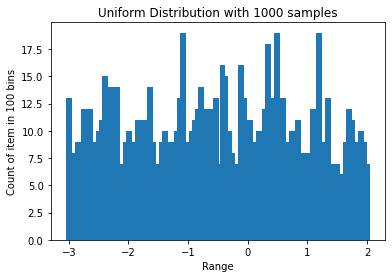
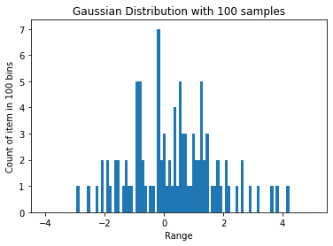
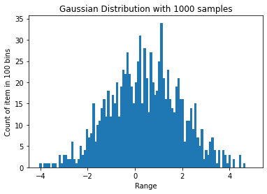

# Programming on Random Number Generation

Sample의 개수가 적을 때에는 히스토그램상 sample의 분포가 원 분포와 다르게 생긴 경우가 있지만, 
개수가 많아질 수록 sample의 분포는 원 분포에 가까워지는 것을 확인할 수 있다.  
이는 컴퓨터에서 계산된 random number 가 정확하게 uniform 한 random 분포가 아니며 컴퓨터에 있는 장비만 가지고는 정확하게 random한 분포를 묘사할 수 없기 때문에 그렇다.  
때문에 컴퓨터는 소수의 성질을 이용한 특정한 연산을 통해 **seed**라고하는 수로부터 시작하여 실제 random과 유사한 수열을 계속해서 얻어내는 것으로 random 한 숫자를 얻기에 정확하게 random한 숫자를 얻지 않는다.  
하지만, sample의 개수가 많아지면 큰 수의 법칙(Law of Large Number)에 의해 원 분포와 비슷한 분포를 갖게 된다.

# How to build and run

>Compile Environment
>
>> Mac 13.0 (22A380)
>>
>> Apple clang version 14.0.0 (clang-1400.0.29.202)

```bash
cd Homework #4
cd Code
./build.sh
./main
```

## A. Uniform Distribution

### A - 1. Histogram of Uniform Distribution in [-3, 2] with 100 samples


|Range|1|2|3|4|5|6|7|8|9|10|
|:-:|:-:|:-:|:-:|:-:|:-:|:-:|:-:|:-:|:-:|:-:|
|[-3.00, -2.50)|2|1|1|2|1|2|2|1|0|2|
|[-2.50, -2.00)|0|0|1|0|0|0|1|1|0|0|
|[-2.00, -1.50)|0|1|0|3|1|0|3|3|0|0|
|[-1.50, -1.00)|1|2|0|0|0|1|1|0|3|0|
|[-1.00, -0.50)|0|4|0|1|0|0|2|1|1|1|
|[-0.50, -0.00)|2|3|3|2|0|1|0|1|1|1|
|[-0.00, +0.50)|0|0|2|1|0|2|0|2|3|0|
|[+0.50, +1.00)|1|0|2|2|1|2|2|1|0|0|
|[+1.00, +1.50)|1|0|1|1|2|0|0|0|2|2|
|[+1.50, +2.00)|2|2|0|2|1|0|0|0|2|1|

### A - 2. Histogram of Uniform Distribution in [-3, 2] with 1000 samples



|Range|1|2|3|4|5|6|7|8|9|10|
|:-:|:-:|:-:|:-:|:-:|:-:|:-:|:-:|:-:|:-:|:-:|
|[-3.00, -2.50)|13| 6| 8| 9| 5|12| 7|12| 9| 8| 
|[-2.50, -2.00)|10|11|15| 9|14|14|14| 7| 6| 9| 
|[-2.00, -1.50)|10| 9| 6|11|11|11| 8|14| 9| 7| 
|[-1.50, -1.00)| 2| 9|10| 7| 9| 9|10|13|19| 5| 
|[-1.00, -0.50)| 9|10|11|12|14|11|12| 9|12|13| 
|[-0.50, -0.00)| 7|16|15|10| 8| 5| 7|16|13|11| 
|[-0.00, +0.50)|11| 6| 9|10| 6|12|18|13|12|19| 
|[+0.50, +1.00)|12|13| 9| 5|10| 9|11| 8| 5| 8| 
|[+1.00, +1.50)| 8|12| 9|19| 8| 9|13| 6| 7| 7| 
|[+1.50, +2.00)| 6| 6| 9|12|11| 9| 9|10| 9| 7| 

### A - 3. Histogram of Uniform Distribution in [-3, 2] with 10000 samples


|Range|1|2|3|4|5|6|7|8|9|10|
|:-:|:-:|:-:|:-:|:-:|:-:|:-:|:-:|:-:|:-:|:-:|
|[-3.00, -2.50)|107|   96|  102|  100|   91|  101|  106|   88|  110|  108|
|[-2.50, -2.00)|105|   93|   95|  104|  108|   85|  111|  115|  101|  107|
|[-2.00, -1.50)|104|   98|  117|   97|  101|   99|   98|   85|  101|  100|
|[-1.50, -1.00)|81|   95|  102|  107|  105|   84|  103|  104|   94|   89|
|[-1.00, -0.50)|99|  106|   83|   87|   97|  105|   87|  101|   98|  111|
|[-0.50, -0.00)|101|  123|  100|   86|  110|  102|   97|  105|   99|  110|
|[-0.00, +0.50)|104|  114|   92|   88|  114|  109|   89|   83|   97|   93|
|[+0.50, +1.00)|104|   97|   85|   88|   96|   93|  109|  103|  101|   93|
|[+1.00, +1.50)|98|  123|  107|   80|  102|   99|  124|  115|   95|   94|
|[+1.50, +2.00)|93|   80|   90|  112|  100|   97|   99|  106|  121|  109|
### A - 4. Histogram of Uniform Distribution in [-3, 2] with 100000 samples


|Range|1|2|3|4|5|6|7|8|9|10|
|:-:|:-:|:-:|:-:|:-:|:-:|:-:|:-:|:-:|:-:|:-:|
|[-3.00, -2.50)|    1012|  995|  983|  931| 1016| 1055|  984| 1067|  948| 1036|
|[-2.50, -2.00)|    951|  959| 1020|  999| 1078| 1016|  989|  980|  994| 1015|
|[-2.00, -1.50)|    962|  990| 1005|  998|  978|  987|  979|  946| 1043| 1013|
|[-1.50, -1.00)|    990|  977| 1036| 1015|  988| 1002| 1005|  986|  990|  933|
|[-1.00, -0.50)|    991|  938|  979| 1022| 1008|  986| 1007| 1031| 1011| 1041|
|[-0.50, -0.00)|    975| 1035| 1039| 1020| 1044| 1016| 1022| 1048| 1033| 1006|
|[-0.00, +0.50)|    1031|  989|  971| 1013|  989|  985|  962|  958| 1025| 1006|
|[+0.50, +1.00)|    989|  933|  987| 1051| 1032|  943| 1053| 1018|  954| 1018|
|[+1.00, +1.50)|    979| 1047|  999| 1044|  984| 1019| 1003|  987|  990| 1064|
|[+1.50, +2.00)|    970|  993|  956| 1076|  972|  992|  967|  943| 1040|  965|

## B. Gaussian Distribution

Rest of samples outside the ranges(m-6s, m+62)  are ignored.

### B - 1. Histogram of Gaussian Distribution with m = 0.5, standard s = 1.5 with 100 samples



|Range|1|2|3|4|5|6|7|8|9|10|
|:-:|:-:|:-:|:-:|:-:|:-:|:-:|:-:|:-:|:-:|:-:|
|[-4.00, -3.10)|0|    0|    0|    0|    0|    0|    0|    0|    0|    0|
|[-3.10, -2.20)|0|    0|    1|    0|    0|    0|    1|    0|    0|    1|
|[-2.20, -1.30)|0|    2|    0|    2|    1|    0|    2|    2|    0|    1|
|[-1.30, -0.40)|2|    1|    1|    0|    5|    5|    2|    1|    0|    1|
|[-0.40, +0.50)|1|    0|    7|    2|    3|    1|    2|    1|    4|    1|
|[+0.50, +1.40)|5|    3|    3|    1|    1|    3|    2|    2|    5|    2|
|[+1.40, +2.30)|3|    0|    1|    1|    2|    1|    0|    2|    1|    0|
|[+2.30, +3.20)|0|    1|    0|    2|    0|    0|    1|    0|    0|    1|
|[+3.20, +4.10)|0|    0|    0|    0|    1|    0|    1|    0|    0|    0|
|[+4.10, +5.00)|1|    0|    0|    0|    0|    0|    0|    0|    0|    0|
### B - 2. Histogram of Gaussian Distribution with m = 0.5, standard s = 1.5 with 1000 samples



|Range|1|2|3|4|5|6|7|8|9|10|
|:-:|:-:|:-:|:-:|:-:|:-:|:-:|:-:|:-:|:-:|:-:|
|[-4.00, -3.10)|     1|    0|    1|    1|    1|    0|    1|    1|    0|    3|
|[-3.10, -2.20)|     1|    3|    3|    2|    2|    6|    2|    1|    2|    5|
|[-2.20, -1.30)|     3|    4|    9|    7|    8|   15|    6|   10|   11|   14|
|[-1.30, -0.40)|    16|   12|   18|   12|   17|   15|   20|   12|   19|   23|
|[-0.40, +0.50)|    22|   27|   22|   19|   15|   20|   25|   31|   15|   28|
|[+0.50, +1.40)|    21|   13|   27|   20|   17|   18|   25|   34|   21|   16|
|[+1.40, +2.30)|    23|   16|   14|   13|   19|   21|   16|   16|    6|   11|
|[+2.30, +3.20)|    11|   14|    9|   15|    7|    5|    9|    2|    4|    3|
|[+3.20, +4.10)|     6|    7|    4|    1|    4|    0|    4|    3|    1|    3|
|[+4.10, +5.00)|     0|    2|    0|    0|    3|    0|    1|    0|    0|    0|

### B - 3. Histogram of Gaussian Distribution with m = 0.5, standard s = 1.5 with 10000 samples


|Range|1|2|3|4|5|6|7|8|9|10|
|:-:|:-:|:-:|:-:|:-:|:-:|:-:|:-:|:-:|:-:|:-:|
|[-4.00, -3.10)|     8|    5|    4|    7|    6|    5|    6|    6|   12|   13| 
|[-3.10, -2.20)|    15|   18|   16|   16|   29|   34|   22|   26|   52|   49| 
|[-2.20, -1.30)|    52|   49|   54|   56|   88|   90|   67|   99|   89|  107| 
|[-1.30, -0.40)|   145|  130|  136|  146|  156|  171|  167|  187|  197|  222| 
|[-0.40, +0.50)|   205|  212|  220|  233|  229|  255|  230|  212|  247|  217| 
|[+0.50, +1.40)|   256|  232|  238|  243|  224|  220|  230|  211|  207|  201| 
|[+1.40, +2.30)|   189|  172|  174|  192|  185|  162|  148|  132|  123|  135| 
|[+2.30, +3.20)|    99|  105|  105|   74|   70|   61|   64|   61|   48|   55| 
|[+3.20, +4.10)|    38|   36|   38|   29|   24|   26|   23|   15|   30|    9| 
|[+4.10, +5.00)|    11|   15|    6|    8|    6|    7|    5|    4|    3|    3| 

### B - 4. Histogram of Gaussian Distribution with m = 0.5, standard s = 1.5 with 100000 samples


|Range|1|2|3|4|5|6|7|8|9|10|
|:-:|:-:|:-:|:-:|:-:|:-:|:-:|:-:|:-:|:-:|:-:|
|[-4.00, -3.10)|    47|   31|   44|   53|   55|   72|   74|  102|  109|  124|
|[-3.10, -2.20)|   153|  177|  194|  188|  271|  272|  331|  324|  381|  476|
|[-2.20, -1.30)|   532|  485|  626|  701|  694|  785|  845|  934| 1060| 1088|
|[-1.30, -0.40)|  1211| 1315| 1380| 1426| 1520| 1709| 1742| 1773| 1922| 2023|
|[-0.40, +0.50)|  1983| 2114| 2157| 2215| 2336| 2373| 2394| 2347| 2459| 2445|
|[+0.50, +1.40)|  2349| 2388| 2446| 2394| 2275| 2194| 2160| 2226| 2125| 2030|
|[+1.40, +2.30)|  1961| 1838| 1758| 1695| 1695| 1622| 1399| 1377| 1296| 1219|
|[+2.30, +3.20)|  1122| 1012| 1000|  884|  768|  749|  654|  571|  546|  493|
|[+3.20, +4.10)|   464|  385|  334|  301|  277|  250|  195|  193|  172|  162|
|[+4.10, +5.00)|   110|  123|   78|   91|   64|   50|   47|   41|   39|   34|