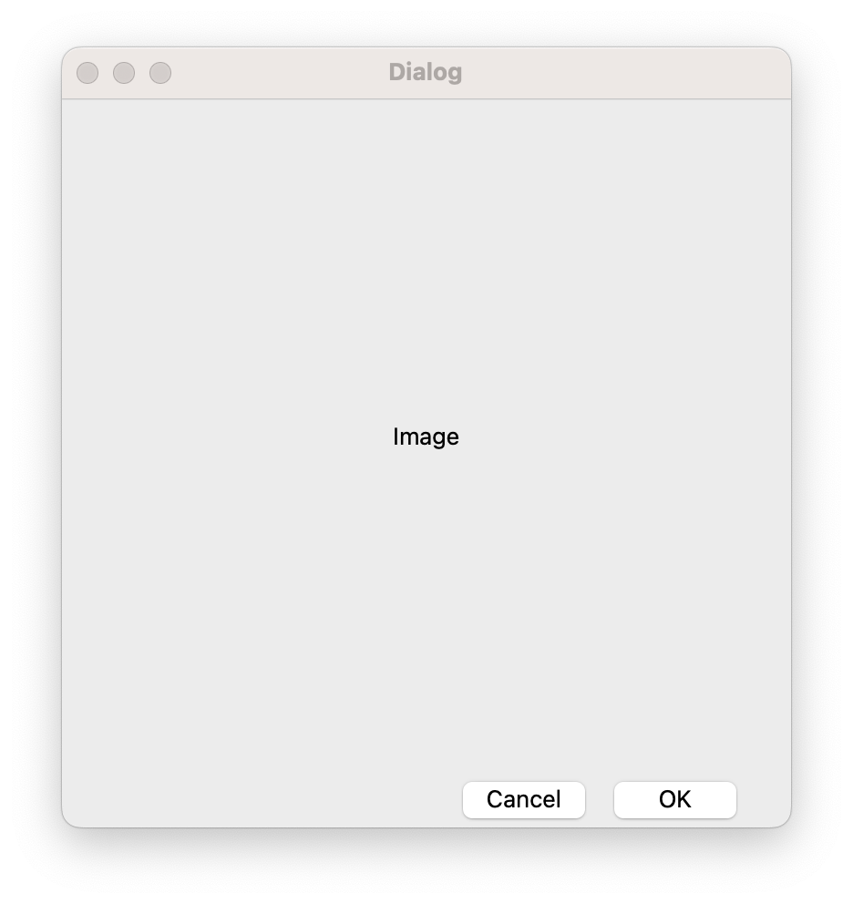
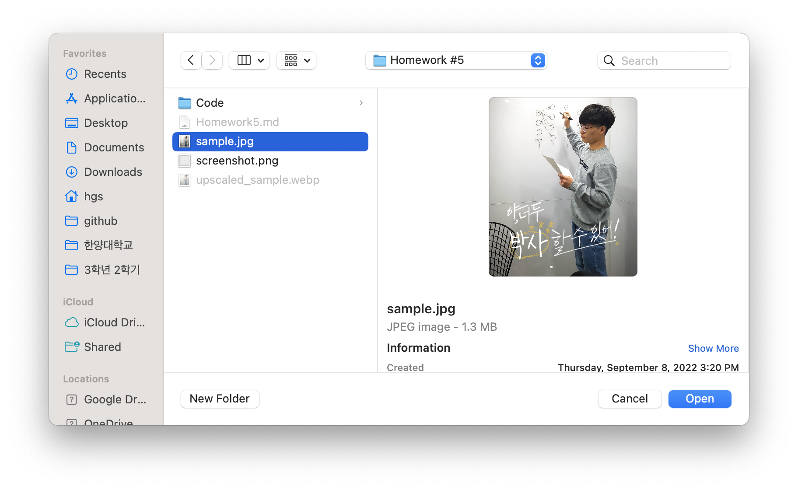
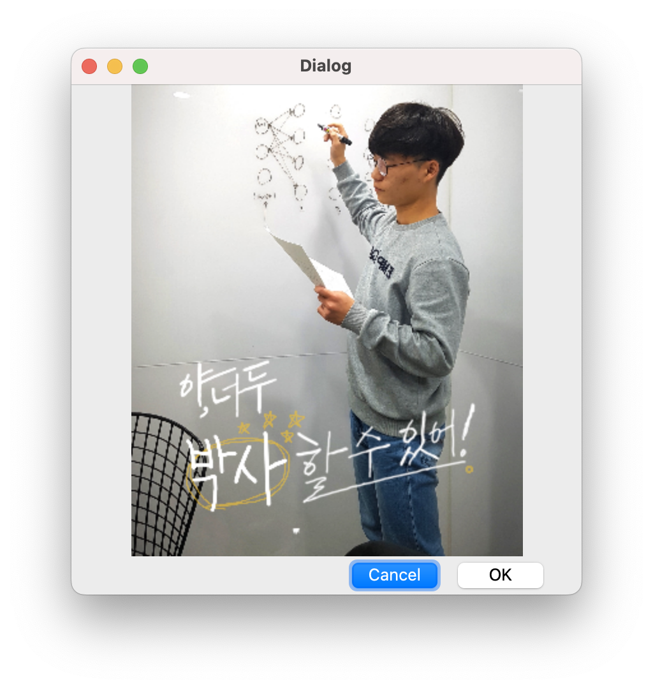

# **Resampling of the image using Bilinear Interpolation**


Upscale the image up to **3x** size

## Results

| Original                                                     |                           Upscaled                           |
| ------------------------------------------------------------ | :----------------------------------------------------------: |
|  |  |


## How to build in Linux/Mac

```
cd "Homework #5"
cd Code
python3 -m venv na
source na/bin/activate
pip install -r requirements.txt 
python main.py
```


## How to build in Windows Powershell

```
cd "Homework #5"
cd Code
python3 -m venv na
na/bin/Activate.ps1
pip install -r requirements.txt
python main.py
```


## How to rescale an image?



```
2. Select the `Image` to rescale
```



`3. Resampled image is shown on the screen and the resampled image is saved into the same directory of the selected original image with the new name of 'upscaled_(image_basename).webp'`



## Implementation Details

**A. Naive Version**

```
def upscaleImage(img, scale):
    assert scale >= 1
    h, w, num_channels = img.shape
    assert num_channels == 4
    new_h, new_w = int(scale * h), int(scale * w)
    
    # Naive Approach
    new_img = np.ones((new_h, new_w, num_channels), dtype=np.uint8)
    for i in range(new_h): # 0 <= i < scale * h
        for j in range(new_w): # 0 <= j < scale * w
            y, x = i // scale, j // scale # 0 <= y < h, 0 <= x < w
            ltop = img[y, x, channels]
            rtop = img[y, x + 1, channels] if x + 1 < w else ltop
            lbot = img[y + 1, x, channels] if y + 1 < h else ltop
            rbot = img[y + 1, x + 1, channels] if x + 1 < w and y + 1 < h else ltop
            vertical_ratio = i / scale - y
            horizontal_ratio = j / scale - x
            l = ltop * (1 - vertical_ratio) + lbot * vertical_ratio
            r = rtop * (1 - vertical_ratio) + rbot * vertical_ratio
            new_img[i, j, channels] = np.clip(0, 255, l * (1 - horizontal_ratio) + r * horizontal_ratio).astype(np.uint8)
    return new_img
```

1. upscale된 이미지를 얻기 위해 빈 3차원 배열을 만든다. 배열은 (높이, 너비, 채널수) 만큼 만든다.
2. 각 픽셀마다 색상값을 얻기 위해 원본 이미지에서의 점 주변의 대응 점(왼쪽 상단, 오른쪽 상단, 왼쪽 하단, 오른쪽 하단)의 색상정보를 활용해 Bilinear Interpolation한다.
   만약, 오른쪽 테두리 또는 하단 테두리의 경우 범위를 넘어가지 않도록 처리하였다.
3. 최종 bilinear interpolation 결과를 uint8타입으로 변환 후 new_img에 저장한다.

하지만, 이러한 방식으로 매 픽셀마다 계산하는 것은 매우 비효율적이므로 numpy의 vectorization(SIMD, MIMD 명령)을 이용하여 조금 더 개선된 버전을 개발했다.

**B. Vectorized Version**

```
def upscaleImage(img, scale):
    assert scale >= 1
    h, w, num_channels = img.shape
    assert num_channels == 4
    new_h, new_w = int(scale * h), int(scale * w)
    
    # Vectorized Code
    new_img = np.arange(new_h * new_w * num_channels, dtype=np.uint)
    fimg = img.flatten()
    i = (new_img // (new_w * num_channels)).astype(np.uint)
    j = (new_img % (new_w * num_channels) // num_channels).astype(np.uint)
    c = (new_img % num_channels).astype(np.uint)
    y = (i // scale).astype(np.uint)
    x = (j // scale).astype(np.uint)
    ny = np.clip(y + 1, 0, h - 1).astype(np.uint)
    nx = np.clip(x + 1, 0, w - 1).astype(np.uint)
    ltop = fimg[y * w * num_channels + x * num_channels + c]
    rtop = fimg[y * w * num_channels + nx * num_channels + c]
    lbot = fimg[ny * w * num_channels + x * num_channels + c]
    rbot = fimg[ny * w * num_channels + nx * num_channels + c]
    vertical_ratio = i / scale - y
    horizontal_ratio = j / scale - x
    l = ltop * (1 - vertical_ratio) + lbot * vertical_ratio
    r = rtop * (1 - vertical_ratio) + rbot * vertical_ratio
    new_img = l * (1 - horizontal_ratio) + r * horizontal_ratio
    new_img = np.clip(new_img, 0, 255).astype(np.uint8)
    new_img = new_img.reshape(new_h, new_w, num_channels)
    return new_img
```

각 픽셀별 채널별 색상 정보를 하나의 거대한 벡터로 처리하여 계산하였다.